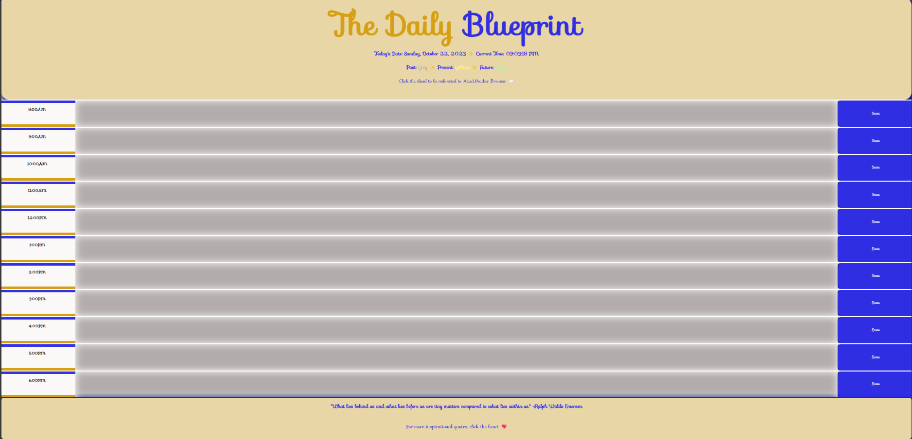

# thedailyblueprint

## Table of Contents
-Description
-Features
-Configuration
-Technologies
-Credits
-Screenshot
-Link

## Desription
Welcome to my intuitive daily planner application designed to help you efficiently manage your schedule from 8am to 6pm. With its user-friendly interface, you can easily visualize your day at a glance. Past events are elegantly displayed in grey, present events in vibrant yellow, and future events in refreshing green. Adding new events is a breeze - simply input the desired hour, save it, and refresh the page to seamlessly store it in your local settings.

## Features
-**Time-based Event Management**: Our planner is meticulously divided into hourly slots, allowing you to effortlessly organize your day from morning to evening 
-**Color-coded Events**: Experience a visually appealing representation of your schedule, with past events gracefully displayed in grey, present events in a vibrant yellow hue, and future events in a refreshing shade of green. 
-**Effortless Event Creation**: Adding new events is a seamless process. Just enter the desired hour, save it, and with a quick page refresh, your event is securely stored in your local settings. 
-**Weather App Integration**: Stay informed about the weather conditions throughout your day. Simply click on the cloud icon in the header to access a link that redirects you to a weather app, providing you with real-time weather updates. 
-**Inspiring Quotes**: Find motivation and inspiration with ease. Our footer includes a heart icon that, when clicked, takes you to a page filled with uplifting and inspiring quotes.

## Configuration
1. Open the daily planner application in your preferred web browser. 2. The planner will display the current day and time, beautifully color-coded to indicate past, present, and future events. 3. To add a new event, locate the desired hour slot and effortlessly input the event details. 4. Click the "Save" button to securely store the event. 5. Refresh the page to ensure the event is seamlessly saved to your local settings. 6. Stay informed about the current weather conditions by clicking on the cloud icon in the header. This will redirect you to a weather app, providing you with up-to-date weather updates. 7. Seek inspiration and motivation by clicking on the heart icon in the footer. This will take you to a page brimming with uplifting and empowering quotes.

## Technologies
-HTML
-CSS
-JavaScript
-JQuery

## Credits
Weather App: Powered by[AccuWeather](https://www.accuweather.com/)- Inspirational Quotes: Sourced from [OberLo](https://www.oberlo.com/blog/motivational-quotes/)- Google Fonts 
Feel free to customize and enhance this daily planner according to your unique preferences. Enjoy effortlessly managing your day while staying inspired!

## Screenshot

## Link
https://github.com/sarahizar/thedailyblueprint
